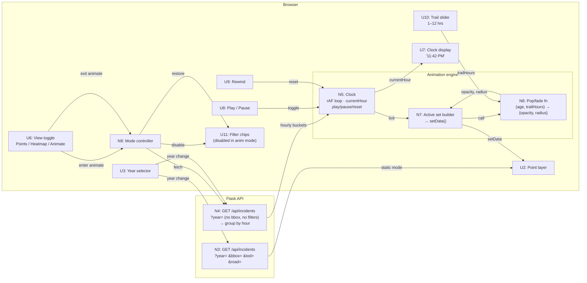

# Time-of-Day Animation — Shaping

Feature-level shaping for the 24-hour animated playback of pedestrian fatality incidents.

---

## Requirements (R)

| ID | Requirement | Status |
|----|-------------|--------|
| R0 | Animate pedestrian fatalities through time so temporal clustering patterns become immediately visible | Core goal |
| R1 | 24-hour day mode: all incidents in a selected year played back across a single compressed day cycle | Must-have |
| R2 | Incidents "pop" when the clock reaches their hour, then fade/decay — creating a visible trail | Must-have |
| R3 | Playback controls: play, pause, rewind | Must-have |
| R4 | Animation speed | Out |
| R5 | Trail/fade duration is user-controllable in the UI | Must-have |
| R6 | Day-of-week mode (animated Mon–Sun with rolling 24hr clock) | Out — phase 2 |
| R7 | Multi-year comparison | Out — phase 2 |
| R8 | Works entirely in-browser, no new backend infra or stack dependencies | Must-have |
| R9 | Animation mode bypasses lighting/road-type filters — always shows full year | Must-have |

---

## Shapes

### A: Data-driven (MapLibre paint expressions)

Each frame, call `setPaintProperty` with a new expression that bakes in the current clock value. MapLibre computes opacity per-point on the GPU.

**Rejected:** `setPaintProperty` triggers style recompilation every call. At animation speed this is expensive. Making trail duration user-controllable (R5) requires rebuilding the expression on every slider change AND every clock tick simultaneously — the two controls fight each other.

---

### B: JS-driven (filter + inject, `setData`) — Selected

Each tick, JS computes which incidents are active within the trail window, injects `opacity` and `radius` properties based on their age, and calls `source.setData()`. MapLibre renders whatever it's given.

| Part | Mechanism | Flag |
|------|-----------|:----:|
| B1 | **Data loader** — fetch `/api/incidents?year=Y` (no bbox, no filters); group into `Map<hour, Feature[]>` client-side | |
| B2 | **Animation clock** — `requestAnimationFrame` loop tracking `currentHour` (0–24 float, loops); fires data update when simulated time advances ≥ 0.1 hr | |
| B3 | **Pop/fade function** — pure: `(age, trailHours) → {opacity, radius}`; `opacity = (1 − age/trailHours)^1.5`; radius bursts on pop, settles quickly | |
| B4 | **Active set builder** — each tick: walk hour buckets within trail window, call B3 per feature, inject properties, call `source.setData()` | |
| B5 | **Playback controls UI** — play/pause toggle, rewind (reset to 00:00), clock display ("11:42 PM"), trail slider (1–12 hrs, default 3) | |
| B6 | **Mode controller** — entering animation: bypass filters, load B1 data, start B2; exiting: cancel loop, restore static source, re-enable filters | |

---

## Fit Check — R × B

| Req | Requirement | Status | B |
|-----|-------------|--------|---|
| R0 | Animate fatalities through time so temporal clustering is immediately visible | Core goal | ✅ |
| R1 | 24-hour day mode: full year played back across a compressed day | Must-have | ✅ |
| R2 | Incidents pop at their hour and fade/decay over time | Must-have | ✅ |
| R3 | Playback controls: play, pause, rewind | Must-have | ✅ |
| R5 | Trail duration user-controllable in UI | Must-have | ✅ |
| R8 | Works in-browser, no new backend or stack dependencies | Must-have | ✅ |
| R9 | Animation mode bypasses filters, shows full year | Must-have | ✅ |

**Notes:**
- R1/B1: no-bbox fetch returns full national dataset; year selector still works in animation mode
- R2/B3: pop/fade is a pure JS function, non-linear decay, tunable via trail slider
- R3/B5: play/pause/rewind all operate on B2 clock state
- R5/B5: trail slider feeds directly into B3 as `trailHours` — no expression recompilation
- R8/B4: `setData` at ~10fps with bounded active set is within MapLibre's limits; no new deps
- R9/B6: mode switch fetches without filter params; filter UI visually disabled while animating

**Selected: B**

---

## Breadboard — Detail B

### UI Affordances

| ID | Place | Affordance | Wires Out |
|----|-------|------------|-----------|
| U1 | Browser | Map viewport — MapLibre GL JS, OpenFreeMap tiles | on `moveend` → N3 (static mode only) |
| U2 | Browser | Incident point layer — data-driven `circle-opacity` and `circle-radius` from injected properties | — |
| U3 | Browser | Year selector — works in both static and animation mode | on `change` → N3 (static) or N4 (animation) |
| U6 | Browser | View toggle — Points / Heatmap / Animate (third option) | on select → N8 |
| U7 | Browser | Clock display — live simulated time ("11:42 PM"), updates each tick | driven by N5 |
| U8 | Browser | Play / Pause button — shown only in animation mode | on click → N5 (toggle) |
| U9 | Browser | Rewind button — resets clock to 00:00 | on click → N5 (reset) |
| U10 | Browser | Trail slider — range 1–12 hrs, default 3, label shows current value | on input → N6 (trailHours) |
| U11 | Browser | Filter chips (lighting, road type) — visually disabled in animation mode | driven by N8 |

### Non-UI Affordances

| ID | Place | Affordance | Wires Out |
|----|-------|------------|-----------|
| N3 | Flask API | `GET /api/incidents?year=&bbox=&tod=&road=` — existing static endpoint | → U2 |
| N4 | Browser | Animation data loader — `GET /api/incidents?year=Y` (no bbox, no filters); groups result into `Map<hour, Feature[]>` | → N5 |
| N5 | Browser | Animation clock — `requestAnimationFrame` loop; tracks `currentHour` (0–24 float, loops); pauses/resumes/resets on command; fires update when simulated time advances ≥ 0.1 hr | → N7, U7 |
| N6 | Browser | Pop/fade function — pure: `(age, trailHours) → {opacity, radius}`; `opacity = (1 − age/trailHours)^1.5`; radius burst decays quickly from peak | called by N7 |
| N7 | Browser | Active set builder — each N5 update: collects features from hour buckets within trail window, calls N6 per feature, injects properties, calls `source.setData()` | → U2 |
| N8 | Browser | Mode controller — on enter animation: disables filters (U11), fetches N4, starts N5; on exit: cancels loop, restores static source data, re-enables filters | → N4, N5, U11 |

### Wiring Diagram

---

## Slices

See [`slices.md`](slices.md) — V7 (animation engine) and V8 (full controls + integration).
