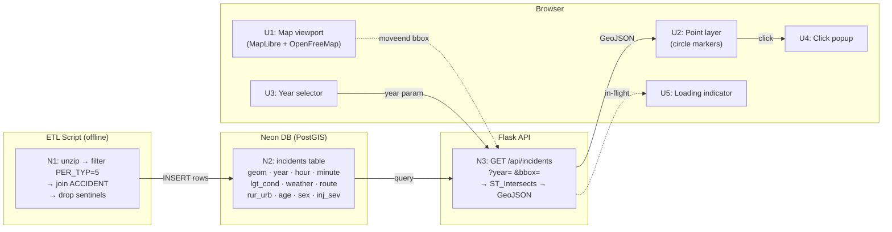

# Pedestrian Safety Mapper — Shaping

## Requirements (R)

| ID | Requirement | Status |
|----|-------------|--------|
| R0 | Show pedestrian fatality incidents on an interactive map using real FARS data | Core goal |
| R1 | 🟡 V1 covers a focused recent slice (2010–2022); schema supports full 2001–2022 expansion without migration | Must-have |
| R2 | 🟡 V1 has a basic year filter; animated time-series is future scope | Must-have |
| R3 | App is deployable and publicly accessible (portfolio demo-able) | Must-have |
| R4 | Data processing pipeline extracts pedestrian records from raw FARS zips | Must-have |
| R5 | Incidents are plotted with geographic coordinates (lat/lon) | Must-have |
| R6 | 🟡 App supports research-driven expansion — new visualizations and external data integrations can be added without a schema rebuild | Must-have |
| R7 | No paid API keys, no subscription services — zero ongoing cost | Must-have |
| R8 | 🟡 ETL preserves the full ACCIDENT + PERSON record (time-of-day, lighting, road type, weather, age, sex) so future features never require re-ingestion | Must-have |

---

## Shapes

### A: Full-stack (Flask + PostGIS + MapLibre)

Build the full vision from the start: Python backend, PostgreSQL/PostGIS database, REST API, MapLibre GL JS frontend.

| Part | Mechanism | Flag |
|------|-----------|:----:|
| A1 | Python ETL: unzip FARS National CSVs (2010–2022 for V1, schema supports 2001–2022), join PERSON (`PER_TYP=5`) → ACCIDENT, preserve full incident record (lat/lon, HOUR, MINUTE, LGT_COND, WEATHER, ROUTE, RUR_URB, AGE, SEX, INJ_SEV), drop sentinel coords, load into PostGIS | |
| A2 | Flask app with API endpoints (incidents by bbox/year) | |
| A3 | PostgreSQL + PostGIS for spatial queries | |
| A4 | MapLibre GL JS frontend (free, open-source — no API key) + OpenFreeMap tiles (no key, no rate limit); Deck.gl available as a future animation layer without replacing MapLibre | |
| A5 | Docker Compose for local dev | |
| A6 | Deployment — see A6 alternatives below | ⚠️ |

### A6 Alternatives: Deployment

**A6-A: Render (Flask) + Supabase (PostgreSQL/PostGIS)**
- Flask web service on Render free tier (spins down after 15 min inactivity; ~60s cold start)
- PostgreSQL + PostGIS on Supabase free tier (500 MB storage; database pauses after 7 days of inactivity)
- Cost: $0

**A6-B: Render (Flask) + Neon (PostgreSQL/PostGIS)**
- Flask web service on Render free tier (same spin-down behaviour)
- PostgreSQL + PostGIS on Neon free tier (500 MB storage; compute scales to zero after 5 min, resumes in ~500ms — much better than Supabase's 7-day pause)
- Cost: $0

> **Storage risk (both A6-A and A6-B):** ~800,000 pedestrian records with a PostGIS GiST spatial index could land between 300 MB and 2 GB+ depending on the schema. Both free tiers cap at 500 MB. This needs to be validated during A1 implementation — if data exceeds 500 MB, upgrading to Supabase Pro ($25/mo, 8 GB) or Neon Launch ($19/mo, 10 GB) may be necessary.

### A6 Fit Check

| Req | Requirement | Status | A6-A | A6-B |
|-----|-------------|--------|------|------|
| R3 | App is deployable and publicly accessible | Must-have | ✅ | ✅ |
| R7 | Zero ongoing cost | Must-have | ✅ | ✅ |

**Notes:**
- Both pass R3 and R7. The differentiator is cold-start behaviour: Neon (A6-B) resumes in ~500ms vs Supabase (A6-A) pausing for up to 7 days and requiring a manual resume or incoming request to wake. For a portfolio project with sporadic traffic, A6-B is the better experience.
- **Selected: A6-B** (Render + Neon) — same cost ($0), better resume behaviour.

---

### ~~B: Static-first (processed GeoJSON + MapBox, no backend)~~ — *Rejected*

> Rejected: feels like a detour from the real goal. The project needs a full-stack stretch, not a shortcut. Shape A is the path forward.

---

## Fit Check (A only — B rejected)

| Req | Requirement | Status | A |
|-----|-------------|--------|---|
| R0 | Show pedestrian fatality incidents on an interactive map using real FARS data | Core goal | ✅ |
| R1 | V1 covers 2010–2022; schema supports full 2001–2022 expansion without migration | Must-have | ✅ |
| R2 | V1 has a basic year filter; animated time-series is future scope | Must-have | ✅ |
| R3 | App is deployable and publicly accessible (portfolio demo-able) | Must-have | ✅ |
| R4 | Data processing pipeline extracts pedestrian records from raw FARS zips | Must-have | ✅ |
| R5 | Incidents are plotted with geographic coordinates (lat/lon) | Must-have | ✅ |
| R6 | Supports research-driven expansion without a schema rebuild | Must-have | ✅ |
| R7 | Zero ongoing cost — no paid API keys or subscription services | Must-have | ✅ |
| R8 | ETL preserves full ACCIDENT + PERSON record for future features | Must-have | ✅ |

**Notes:**
- R1/R2 scoped: V1 ingests 2010–2022 (~500k records, within Neon 500 MB target). Full 2001–2022 is a later expansion. Animation is future scope.
- R3 resolved: A6-B selected — Render (Flask) + Neon (PostGIS), $0.
- R5 resolved: spike confirmed decimal lat/lon 2001–2022. Pre-2001 in Issue #1.
- R6/R8 satisfied: A1 now joins PERSON → ACCIDENT and preserves time-of-day, lighting, weather, road type, age, sex. A4 notes Deck.gl as the future animation layer.
- R7 resolved: MapLibre GL JS + OpenFreeMap + Render free + Neon free = $0.

---

## Breadboard: Detail A

### UI Affordances

| ID | Place | Affordance | Wires Out |
|----|-------|-----------|-----------|
| U1 | Browser | Map viewport — MapLibre GL JS initialised, OpenFreeMap vector tiles | on `moveend` → N3 (V4) |
| U2 | Browser | Incident point layer — circle markers rendered from GeoJSON source | on `click` → U4 |
| U3 | Browser | Year selector — dropdown, range 2010–2022 | on `change` → N3 |
| U4 | Browser | Incident popup — date, time of day, road type, lighting, weather, victim age/sex | — |
| U5 | Browser | Loading indicator — shown while N3 request in flight | — |

### Non-UI Affordances

| ID | Place | Affordance | Wires Out |
|----|-------|-----------|-----------|
| N1 | ETL script | Unzip FARS CSV → filter PERSON `PER_TYP=5` → join ACCIDENT → drop sentinel coords → emit rows | → N2 |
| N2 | Neon DB | `incidents` table: `geom GEOMETRY(Point,4326)`, `year`, `hour`, `minute`, `lgt_cond`, `weather`, `route`, `rur_urb`, `age`, `sex`, `inj_sev`, `state`, `county` + GiST index on `geom` | — |
| N3 | Flask API | `GET /api/incidents?year=&bbox=` → `ST_Intersects(geom, ST_MakeEnvelope(...))` → GeoJSON FeatureCollection | → U2, U5 |

### Wiring Diagram

