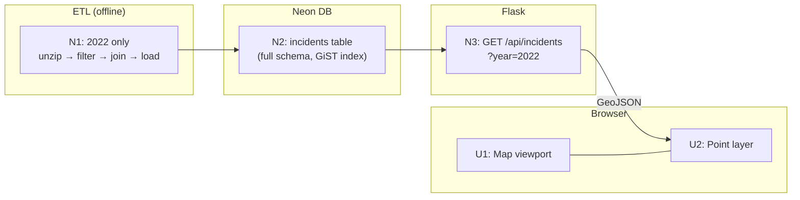
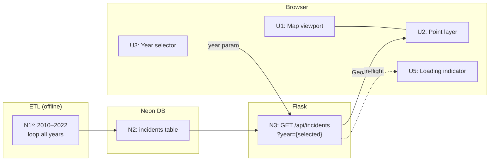
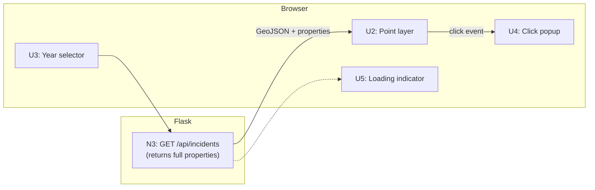
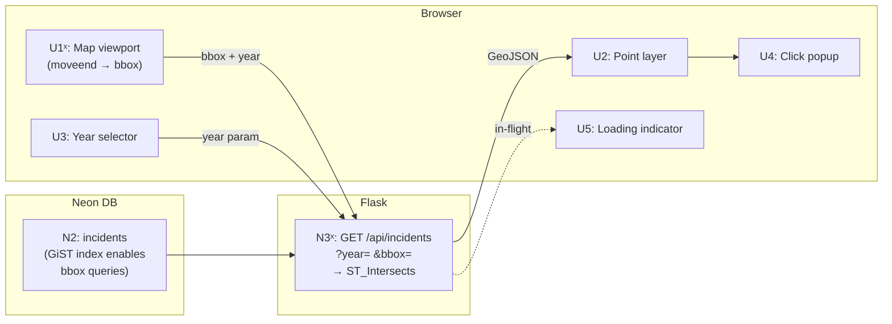

# Pedestrian Safety Mapper — Slices

Derived from Shape A breadboard. Each slice ends in demo-able UI and is a full vertical cut through the stack.

## Slice Definitions

| Slice | Name | Status | Demo |
|-------|------|:------:|------|
| V1 | Data on the map | ✅ Shipped | Open the app — see 2022 pedestrian fatalities as dots on a US map |
| V2 | Year selector | ✅ Shipped | Pick any year 2010–2022 — map updates to show that year's incidents |
| V3 | Incident detail popup | ✅ Shipped | Click any dot — see date, time of day, road type, lighting, weather, victim age/sex |
| V4 | Viewport-based loading | ✅ Shipped | Pan or zoom — incidents load dynamically; map stays fast at any zoom level |

> **Note:** V2, V3, and V4 frontend affordances (U3, U4, U5, U1ˣ) were built alongside V1 in the initial scaffold. V4 backend (N3ˣ bbox param) was also included from the start. V4 frontend wire-up (moveend → bbox fetch) completed in the follow-on session.
| V4 | Viewport-based loading | Pan or zoom — visible incidents load dynamically; map stays fast at any zoom level |

---

## V1: Data on the Map

**Goal:** Prove the full stack end-to-end. Real data, real map, deployed.

### UI Affordances

| ID | Place | Affordance | Wires Out |
|----|-------|-----------|-----------|
| U1 | Browser | Map viewport — MapLibre GL JS, OpenFreeMap tiles, centred on US | — |
| U2 | Browser | Incident point layer — circle markers from GeoJSON source, 2022 hardcoded | — |

### Non-UI Affordances

| ID | Place | Affordance | Wires Out |
|----|-------|-----------|-----------|
| N1 | ETL script | Unzip 2022 FARS CSV → filter `PER_TYP=5` → join ACCIDENT → drop sentinels → emit rows | → N2 |
| N2 | Neon DB | `incidents` table created with full schema (all columns from A1) + GiST index on `geom` | — |
| N3 | Flask API | `GET /api/incidents?year=2022` → query N2 → return GeoJSON FeatureCollection | → U2 |

### Wiring

---

## V2: Year Selector

**Goal:** Make the map navigable by year. Extend ETL to full 2010–2022 dataset.

### UI Affordances (adds to V1)

| ID | Place | Affordance | Wires Out |
|----|-------|-----------|-----------|
| U3 | Browser | Year selector — dropdown, 2010–2022, defaults to most recent year | on `change` → N3 |
| U5 | Browser | Loading indicator — spinner shown while API request in flight | — |

### Non-UI Affordances (adds to V1)

| ID | Place | Affordance | Wires Out |
|----|-------|-----------|-----------|
| N1ˣ | ETL script | Extended to loop 2010–2022 (N2 schema unchanged) | → N2 |

### Wiring

---

## V3: Incident Detail Popup

**Goal:** Let users explore individual incidents. No backend changes — all data already stored in N2 via R8.

### UI Affordances (adds to V2)

| ID | Place | Affordance | Wires Out |
|----|-------|-----------|-----------|
| U4 | Browser | Click popup — shows: date, time of day, road type (ROUTE), lighting (LGT_COND), weather (WEATHER), victim age (AGE), victim sex (SEX), injury severity (INJ_SEV) | — |

### Non-UI Affordances

*None new — N3 already returns the full feature properties payload from N2.*

### Wiring

---

## V4: Viewport-Based Loading

**Goal:** Keep the map fast at any zoom level by only fetching incidents in the visible viewport.

### UI Affordances (modifies V3)

| ID | Place | Affordance | Wires Out |
|----|-------|-----------|-----------|
| U1ˣ | Browser | Map viewport — adds `moveend` + `zoomend` event listener | on event → N3 with current bbox |

### Non-UI Affordances (modifies V3)

| ID | Place | Affordance | Wires Out |
|----|-------|-----------|-----------|
| N3ˣ | Flask API | `GET /api/incidents?year=&bbox=minLon,minLat,maxLon,maxLat` → `ST_Intersects(geom, ST_MakeEnvelope(minLon,minLat,maxLon,maxLat,4326))` | → U2, U5 |

### Wiring

---

## Full Sliced Breadboard

Affordances by slice:

| ID | Affordance | V1 | V2 | V3 | V4 |
|----|-----------|:--:|:--:|:--:|:--:|
| N1 | ETL: 2022 only | ✅ | | | |
| N1ˣ | ETL: extended 2010–2022 | | ✅ | | |
| N2 | incidents table (full schema + GiST) | ✅ | | | |
| N3 | GET /api/incidents?year= | ✅ | | | |
| N3ˣ | + bbox param + ST_Intersects | | | | ✅ |
| U1 | Map viewport (MapLibre + tiles) | ✅ | | | |
| U1ˣ | + moveend/zoomend → bbox | | | | ✅ |
| U2 | Incident point layer | ✅ | | | |
| U3 | Year selector | | ✅ | | |
| U4 | Click popup | | | ✅ | |
| U5 | Loading indicator | | ✅ | | |
