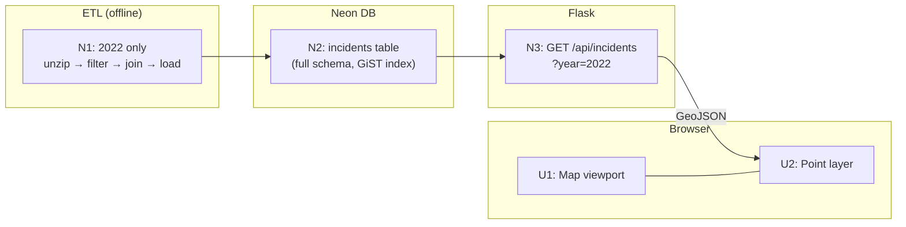
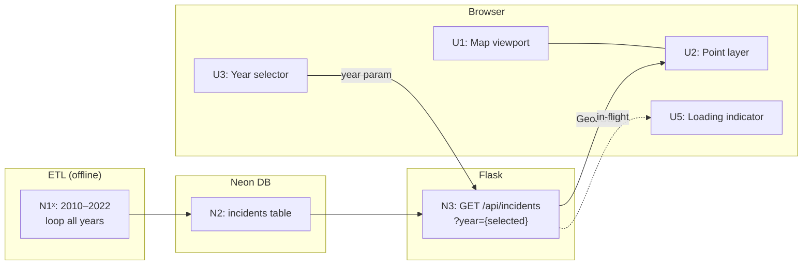
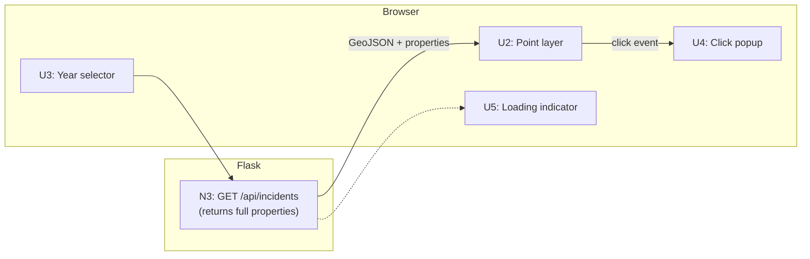
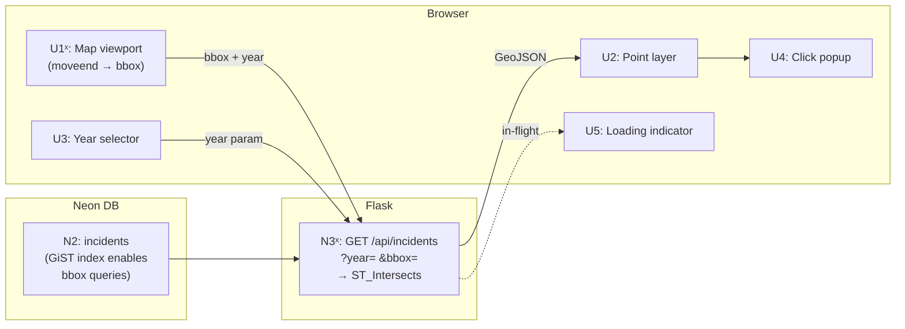
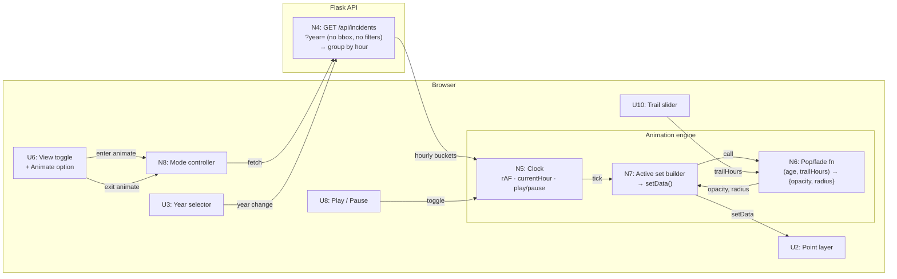
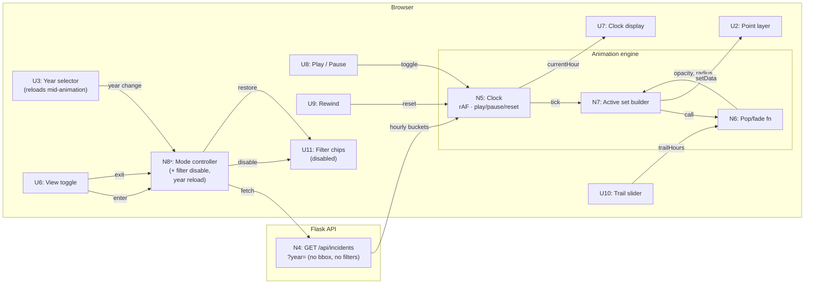

# Pedestrian Safety Mapper — Slices

Derived from Shape A breadboard. Each slice ends in demo-able UI and is a full vertical cut through the stack.

## Slice Definitions

| Slice | Name | Status | Demo |
|-------|------|:------:|------|
| V1 | Data on the map | ✅ Shipped | Open the app — see 2022 pedestrian fatalities as dots on a US map |
| V2 | Year selector | ✅ Shipped | Pick any year 2010–2022 — map updates to show that year's incidents |
| V3 | Incident detail popup | ✅ Shipped | Click any dot — see date, time of day, road type, lighting, weather, victim age/sex |
| V4 | Viewport-based loading | ✅ Shipped | Pan or zoom — incidents load dynamically; map stays fast at any zoom level |
| V5 | Extended history | ✅ Shipped | Year selector covers 2001–2022; 123k+ incidents loaded |
| V6 | UI polish + filters | ✅ Shipped | Dark panel, colour-coded by lighting, filter chips, trend indicator, heatmap toggle |
| V7 | Animation engine | 🔜 Next | Click Animate — incidents pop and fade across the US as the 24-hr clock rolls |
| V8 | Animation controls + integration | 🔜 Next | Clock display, rewind, year change mid-animation, filter chips disabled |

> **Note:** V2, V3, and V4 frontend affordances (U3, U4, U5, U1ˣ) were built alongside V1 in the initial scaffold. V4 backend (N3ˣ bbox param) was also included from the start. V4 frontend wire-up (moveend → bbox fetch) completed in the follow-on session.
| V4 | Viewport-based loading | Pan or zoom — visible incidents load dynamically; map stays fast at any zoom level |

---

## V1: Data on the Map

**Goal:** Prove the full stack end-to-end. Real data, real map, deployed.

### UI Affordances

| ID | Place | Affordance | Wires Out |
|----|-------|-----------|-----------|
| U1 | Browser | Map viewport — MapLibre GL JS, OpenFreeMap tiles, centred on US | — |
| U2 | Browser | Incident point layer — circle markers from GeoJSON source, 2022 hardcoded | — |

### Non-UI Affordances

| ID | Place | Affordance | Wires Out |
|----|-------|-----------|-----------|
| N1 | ETL script | Unzip 2022 FARS CSV → filter `PER_TYP=5` → join ACCIDENT → drop sentinels → emit rows | → N2 |
| N2 | Neon DB | `incidents` table created with full schema (all columns from A1) + GiST index on `geom` | — |
| N3 | Flask API | `GET /api/incidents?year=2022` → query N2 → return GeoJSON FeatureCollection | → U2 |

### Wiring

---

## V2: Year Selector

**Goal:** Make the map navigable by year. Extend ETL to full 2010–2022 dataset.

### UI Affordances (adds to V1)

| ID | Place | Affordance | Wires Out |
|----|-------|-----------|-----------|
| U3 | Browser | Year selector — dropdown, 2010–2022, defaults to most recent year | on `change` → N3 |
| U5 | Browser | Loading indicator — spinner shown while API request in flight | — |

### Non-UI Affordances (adds to V1)

| ID | Place | Affordance | Wires Out |
|----|-------|-----------|-----------|
| N1ˣ | ETL script | Extended to loop 2010–2022 (N2 schema unchanged) | → N2 |

### Wiring

---

## V3: Incident Detail Popup

**Goal:** Let users explore individual incidents. No backend changes — all data already stored in N2 via R8.

### UI Affordances (adds to V2)

| ID | Place | Affordance | Wires Out |
|----|-------|-----------|-----------|
| U4 | Browser | Click popup — shows: date, time of day, road type (ROUTE), lighting (LGT_COND), weather (WEATHER), victim age (AGE), victim sex (SEX), injury severity (INJ_SEV) | — |

### Non-UI Affordances

*None new — N3 already returns the full feature properties payload from N2.*

### Wiring

---

## V4: Viewport-Based Loading

**Goal:** Keep the map fast at any zoom level by only fetching incidents in the visible viewport.

### UI Affordances (modifies V3)

| ID | Place | Affordance | Wires Out |
|----|-------|-----------|-----------|
| U1ˣ | Browser | Map viewport — adds `moveend` + `zoomend` event listener | on event → N3 with current bbox |

### Non-UI Affordances (modifies V3)

| ID | Place | Affordance | Wires Out |
|----|-------|-----------|-----------|
| N3ˣ | Flask API | `GET /api/incidents?year=&bbox=minLon,minLat,maxLon,maxLat` → `ST_Intersects(geom, ST_MakeEnvelope(minLon,minLat,maxLon,maxLat,4326))` | → U2, U5 |

### Wiring

---

---

## V7: Animation Engine

**Goal:** Get the 24-hour animation running end-to-end. Incidents pop and fade as the clock rolls. Play/pause and trail control work.

### UI Affordances (adds to V6)

| ID | Place | Affordance | Wires Out |
|----|-------|------------|-----------|
| U6 | Browser | View toggle — adds "Animate" as third option alongside Points / Heatmap | on select → N8 |
| U8 | Browser | Play / Pause button — shown only in animation mode | on click → N5 (toggle) |
| U10 | Browser | Trail slider — range 1–12 hrs, default 3, label shows current value | on input → N6 (trailHours) |

### Non-UI Affordances (adds to V6)

| ID | Place | Affordance | Wires Out |
|----|-------|------------|-----------|
| N4 | Browser | Animation data loader — `GET /api/incidents?year=Y` (no bbox, no filters); groups result into `Map<hour, Feature[]>` | → N5 |
| N5 | Browser | Animation clock — `requestAnimationFrame` loop; tracks `currentHour` (0–24 float, loops); fires update when simulated time advances ≥ 0.1 hr; pauses/resumes on command | → N7 |
| N6 | Browser | Pop/fade function — pure: `(age, trailHours) → {opacity, radius}`; `opacity = (1 − age/trailHours)^1.5`; radius bursts on pop, settles quickly | called by N7 |
| N7 | Browser | Active set builder — each N5 update: collects features from hour buckets within trail window, calls N6 per feature, injects `opacity`/`radius` properties, calls `source.setData()` | → U2 |
| N8 | Browser | Mode controller — on enter: fetches N4, starts N5; on exit: cancels loop, restores static source data | → N4, N5 |

### Wiring

---

## V8: Animation Controls + Integration

**Goal:** Complete the animation experience — clock display, rewind, year change mid-animation, filter chips disabled while animating.

### UI Affordances (adds to V7)

| ID | Place | Affordance | Wires Out |
|----|-------|------------|-----------|
| U7 | Browser | Clock display — live simulated time ("11:42 PM"), updates each tick | driven by N5 |
| U9 | Browser | Rewind button — resets clock to 00:00 | on click → N5 (reset) |
| U11 | Browser | Filter chips (lighting, road type) — visually disabled in animation mode | driven by N8 |

### Non-UI Affordances (modifies V7)

| ID | Place | Affordance | Wires Out |
|----|-------|------------|-----------|
| N8ˣ | Browser | Mode controller extended — on enter: also disables U11; year change while animating cancels current N4 fetch, reloads, restarts N5; on exit: re-enables U11 | → N4, N5, U11 |

### Wiring

---

## Full Sliced Breadboard

Affordances by slice:

| ID | Affordance | V1 | V2 | V3 | V4 | V5 | V6 | V7 | V8 |
|----|-----------|:--:|:--:|:--:|:--:|:--:|:--:|:--:|:--:|
| N1 | ETL: 2022 only | ✅ | | | | | | | |
| N1ˣ | ETL: extended 2010–2022 | | ✅ | | | | | | |
| N1ˣˣ | ETL: extended 2001–2009 | | | | | ✅ | | | |
| N2 | incidents table (full schema + GiST) | ✅ | | | | | | | |
| N3 | GET /api/incidents?year= | ✅ | | | | | | | |
| N3ˣ | + bbox param + ST_Intersects | | | | ✅ | | | | |
| N3ˣˣ | + tod= / road= filter params | | | | | | ✅ | | |
| N3ˢ | GET /api/summary → {year: count} | | | | | | ✅ | | |
| N4 | Animation data loader (no bbox, group by hour) | | | | | | | ✅ | |
| N5 | Animation clock (rAF loop) | | | | | | | ✅ | |
| N6 | Pop/fade function | | | | | | | ✅ | |
| N7 | Active set builder → setData | | | | | | | ✅ | |
| N8 | Mode controller (enter/exit) | | | | | | | ✅ | |
| N8ˣ | + filter disable + year reload mid-animation | | | | | | | | ✅ |
| U1 | Map viewport (MapLibre + tiles) | ✅ | | | | | | | |
| U1ˣ | + moveend/zoomend → bbox | | | | ✅ | | | | |
| U2 | Incident point layer | ✅ | | | | | | | |
| U3 | Year selector | | ✅ | | | | | | |
| U4 | Click popup | | | ✅ | | | | | |
| U5 | Loading indicator | | ✅ | | | | | | |
| U6 | View toggle (+ Animate option) | | | | | | | ✅ | |
| U7 | Clock display | | | | | | | | ✅ |
| U8 | Play / Pause button | | | | | | | ✅ | |
| U9 | Rewind button | | | | | | | | ✅ |
| U10 | Trail slider | | | | | | | ✅ | |
| U11 | Filter chips disabled in animation mode | | | | | | | | ✅ |
